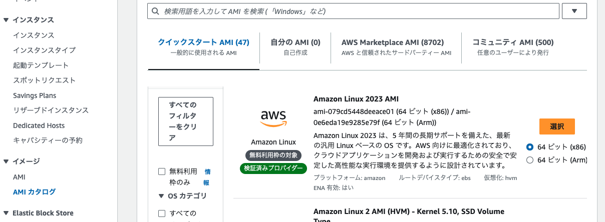
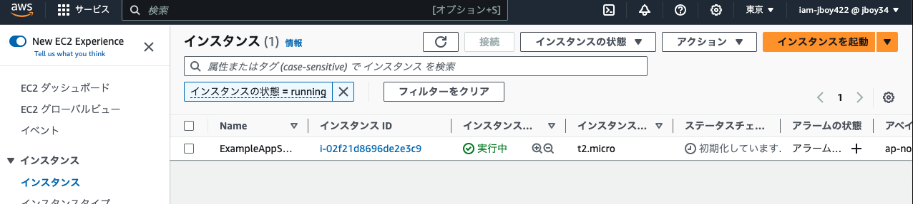
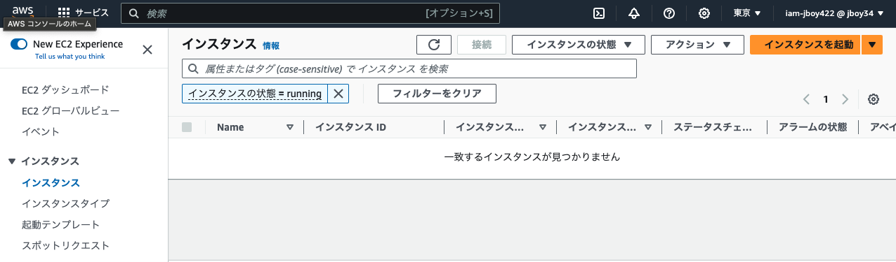

# TerraformでEC2インスタンスを作成する
こちらのチュートリアルを参考にEC2インスタンスを作成します。

https://developer.hashicorp.com/terraform/tutorials/aws-get-started/aws-build

## 事前準備
AWS CLIをインストールしておきます。

各 Terraform 構成は、独自の作業ディレクトリに存在する必要があります。構成用のディレクトリを作成します。

```bash
mkdir learn-terraform-aws-instance
```

ディレクトリに移動します。
```bash
cd learn-terraform-aws-instance
```

インフラストラクチャを定義するファイルを作成します。
```bash
touch main.tf
```

テキスト エディタで開きmain.tf、以下の設定を貼り付けて、ファイルを保存します。

```hcl
# Terraformのバージョンを指定
terraform {
  required_providers {
    aws = {
      source  = "hashicorp/aws"# プロバイダーのソースを指定
      version = "~> 4.16"# プロバイダーのバージョンを指定
    }
  }

  required_version = ">= 1.3.8"# Terraformのバージョンを指定
}

provider "aws" {
  region  = "ap-northeast-1"# リージョンを指定
}

# amiの箇所はAWSのEC2のAMIカタログから確認する。Amazon Linux 2023 AMIを指定した。
resource "aws_instance" "app_server" {
  ami           = "ami-079cd5448deeace01"# AMIを指定。AMIとはAmazon Machine Imageの略で、EC2インスタンスを作成する際のテンプレートのようなもの。
  instance_type = "t2.micro"# インスタンスタイプを指定。t2.microはEC2インスタンスのスペックで、1CPU、1GBのメモリを持つインスタンス。無料枠で使える

  tags = {
    Name = "ExampleAppServerInstance"# インスタンスにNameタグを付ける
  }
}
```

これは、Terraform でデプロイできる完全な構成です。次のセクションでは、この構成の各ブロックを詳しく説明します。

## プロバイダー
このproviderブロックは、指定されたプロバイダー (この場合は ) を構成しますaws。プロバイダーは、Terraform がリソースの作成と管理に使用するプラグインです。

Terraform 構成で複数のプロバイダー ブロックを使用して、さまざまなプロバイダーからのリソースを管理できます。異なるプロバイダーを併用することもできます。たとえば、AWS EC2 インスタンスの IP アドレスを DataDog からモニタリング リソースに渡すことができます。

## リソース
ブロックを使用してresourceインフラストラクチャのコンポーネントを定義します。リソースは、EC2 インスタンスなどの物理コンポーネントまたは仮想コンポーネントである場合もあれば、Heraku アプリケーションなどの論理リソースである場合もあります。

リソース ブロックには、ブロックの前にリソース タイプとリソース名という 2 つの文字列があります。この例では、リソース タイプは でaws_instance、名前は ですapp_server。タイプのプレフィックスはプロバイダーの名前にマップされます。構成例では、Terraform はプロバイダーaws_instanceを使用してリソース を管理しますaws。リソース タイプとリソース名を組み合わせると、リソースの一意の ID が形成されます。たとえば、EC2 インスタンスの ID は です aws_instance.app_server。


## ディレクトリを初期化する
新しい構成を作成するとき、またはバージョン管理から既存の構成をチェックアウトするときは、 を使用してディレクトリを初期化する必要がありますterraform init。

構成ディレクトリを初期化すると、構成で定義されたプロバイダー (この場合はプロバイダー) がダウンロードされ、インストールされますaws。

ディレクトリを初期化します。
```bash
terraform init
```

## プランを作成する
を使用して、Terraform が実行する変更を確認できますterraform plan。このコマンドは、構成を読み取り、リソースを作成するために必要なすべてのアクションを計算します。このコマンドを実行すると、Terraform は、作成、更新、または削除する必要があるリソースのリストを表示します。

```bash
terraform plan
```

## リソースを作成する
を使用して、Terraform が構成で定義されているリソースを作成することができますterraform apply。このコマンドを実行すると、Terraform は、構成で定義されているリソースを作成し、作成したリソースの一覧を表示します。

```bash
terraform apply
```

## リソースを削除する
を使用して、Terraform が構成で定義されているリソースを削除することができますterraform destroy。このコマンドを実行すると、Terraform は、構成で定義されているリソースを削除し、削除したリソースの一覧を表示します。

```bash
terraform destroy
```

## amiの確認方法
リージョンによって異なるので、AWSのEC2のAMIカタログから確認する。


## リソースの作成と削除のスクリーンショット
applyに成功するとEC2のリソースが作成されている。


destroyに成功するとEC2のリソースが削除されている。
